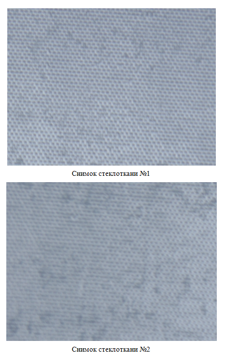
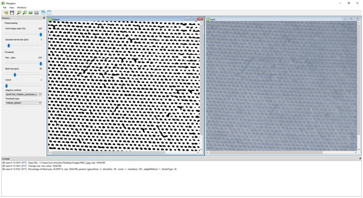

# Fiberglass v 0.1

  ## О чем проект. 
  В промышленности очень часто возникает задача контроля и улучшения качества изделий. Для ее решения необходимо обнаруживать и локализовывать дефекты в выпускаемой продукции или в сырье. В проекте рассматривается предметная область, связанная с производством стеклопластика - это композитный материал, который представляет собой стеклоткань, пропитанную различными лаками и смолами. Готовую продукцию, как правило, получают пропитыванием стеклоткани эпоксидной, полиэфирной или фенолформальдегидной смолой с последующим отверждением и распрессовкой. Обрабатываемая таким образом стеклоткань может иметь различные дефекты, образовавшиеся на поверхности волокон. Основные дефекты стеклопластика связаны с неравномерным нанесением - пропиткой стеклянного волокна полимерными связующими. Для достижения оптимального уровня качества выпускаемой продукции необходимо контролировать толщину нанесения полимеров. Происходит это за счет фотографирования стеклоткани на этапе нанесения смол и отвердителя с последующей обработкой изображений специализированным программным обеспечением. 
  
  
  
  Проект __Fiberglass__ это попыитка реализовать задачу обнаружения и сегментации дефектов на фотоизображениях стеклоплпстика c помощью C++, OpenCV, QT
  
  
  
  
